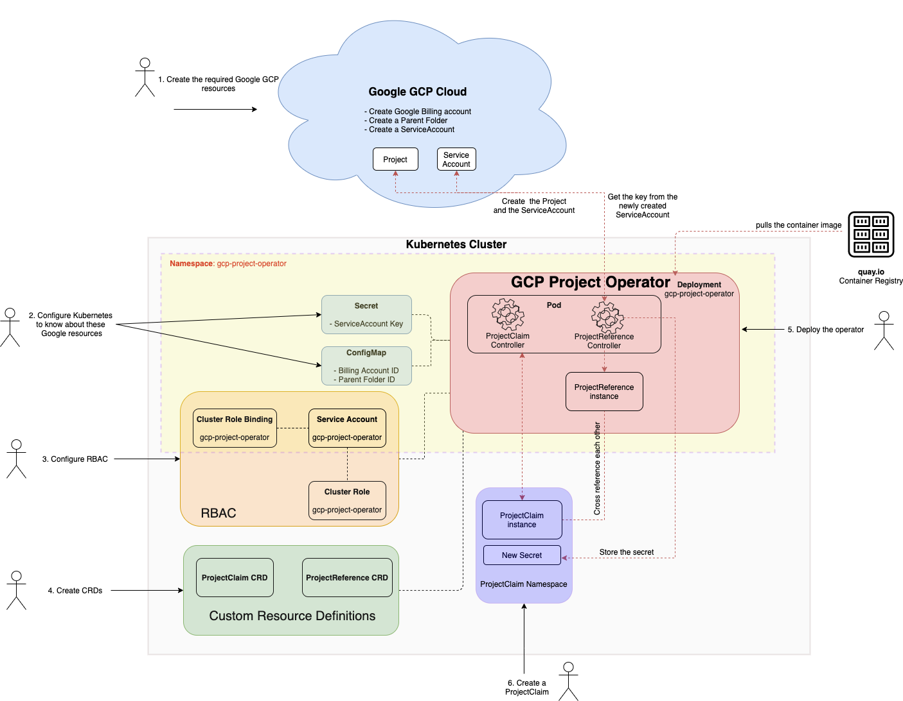

# Design

This document describes the design and interaction between the custom resource definitions that the GCP Project Operator introduces.

The custom resources that the GCP Project Operator introduces:

* `ProjectClaim`
* `ProjectReference`

## ProjectClaim

The `ProjectClaim` custom resource definition (CRD) declaratively defines a desired specification for a GCP Project setup to run a Kubernetes cluster.
It provides options to configure your cluster's [region and zone](https://cloud.google.com/compute/docs/regions-zones), legal entity and credentials such as the GCP secret.

For each `ProjectClaim` resource, the Operator deploys a properly configured `ProjectReference` in the `gcp-project-operator` namespace.
It also adds a Finalizer to make sure `ProjectClaim` is not going to get deleted while `ProjectReference` exists.

## ProjectReference

The `ProjectReference` custom resource definition (CRD) defines the actual project setup to run inside Google GCP. It is generated automatically by the Operator instead of the user. 

Since this is generated by the Operator, the tracking of the parent object is done by the `projectClaimCRLink` that includes the `CLAIMNAME` and the `CLAIMNAMESPACE` of the `ProjectClaim` which created this `ProjectReference` resource.

The [creation of a GCP Project](https://cloud.google.com/resource-manager/docs/creating-managing-projects) requires a _unique_ identifier which gets generated by the Operator.
It can be found in the `gcpProjectID` spec and can be accessed online via the [Google's GCP Resource Manager](https://console.cloud.google.com/cloud-resource-manager).

Before the actual creation of the Project in GCP, the Operator adds a finalizer to make sure this `ProjectReference` cannot be deleted by accident.
When the user requests the deletion of the project, the finalizer makes sure the `ProjectReference` is not deleted unless both the actual project in Google GCP and the `gcp-secret` have been deleted as well.